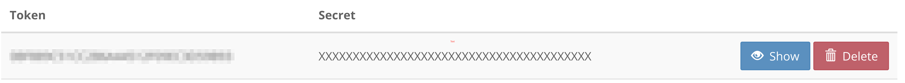

# Deploying to shinyapps.io

This document details multiple approaches to deploying a tutorial created with the [`{learnr}`](https://rstudio.github.io/learnr) package. 

## Resources

The steps in this tutorial draw from these excellent resources:

* Publishing on shinyapps.io [vignette](https://rstudio.github.io/learnr/articles/shinyapps-publishing.html)
* Basics on publishing `learnr` tutorials [vignette](https://pkgs.rstudio.com/learnr/articles/publishing.html) 
* Deploying Shiny Documents [chapter](https://bookdown.org/yihui/rmarkdown/shiny-deploy.html) from [R Markdown: The Definitive Guide](https://bookdown.org/yihui/rmarkdown)

## Pre-requisites

You will need an account on the [shinyapps.io](https://shinyapps.io) platform. Accounts are free and can be upgraded to paid tiers if needed. Once your account is created, you will need to obtain your account's token and secret for future deployments. In the dashboard of your account, visit **Account** and the **Tokens** section in the sidebar. Then you will see the token viewer. Click the **Add Token** button and a new entry will appear that looks similar to this:



Click the **Show** button to display R code you can use within RStudio (or other IDEs) to help define your tokens in the R session. This only needs to be done once in your environment. The code snippet should be similar to the anonymized version below (note that you need to click the **Show Secret** button to display the secret):

```r
rsconnect::setAccountInfo(name='accountid',
			  token='aaaaaaaaaaaaaaaaaaaaaaaaaaaaaaaa',
			  secret='bbbbbbbbbbbbbbbbbbbbbbbbbbbbb')
```

## Deployment

### RStudio IDE

* Open your project with the `learnr` tutorial in RStudio and in particular open the R-Markdown file containing your primary document of the tutorial. In this repository, the file is `tron/index.Rmd`.
* Click the **Publish your application or document** button (looks like a small blue circle) in the editor toolbar and select **Publish Document**
* A new dialog appears asking you to connect your account. Select **ShinyApps.io** and in the resulting screen, paste in the snippet you copied from the shinyapps.io dashboard into the text area. Then your account should be ready to go. See the mini gallery below for the visual of these steps.
* Another dialog appears asking your to confirm the files included in the deployment. At a minimum, the R Markdown file of the tutorial should be automatically selected. If additional files such as stylesheets or child documents are used in your tutorial, ensure those are selected as well. You can change the title text as you see fit. When ready, click the **Publish** button
* Within RStudio, you will see the log output of the deployment process in the **Deploy** tab of the pane that also contains your R console, terminal, etc. Assuming no errors occur, your application is ready to be viewed.
* If your tutorial file was named `index.Rmd` such as the example in this repository, you should be able to access your application with a URL similar to the following: `https://accountid.shinyapps.io/<app_dir>` where `app_dir` is the title of the application you put in the deployment dialog. You can also see your application in the shinyapps.io dashboard which also has the direct link.


### Automated deployment via R

Alternatively, you can also deploy your application semi-automatically using the [{`rsconnect`}]() package, which is the underpinnings of the procedure above. The `deploy_shinyapps.io.R` script contains example code that uses the tutorial in this repository and can easily be adapted to your particular tutorial. The only pre-requisite is to define environment variables associated with your shinyapps.io account. See the template file `Renviron.example` for the general syntax of this file. Note that after making any changes to your `.Renviron` file, you need to re-start your R session before the variables will be available in your session.

## Post-deployment

If you need to make any changes to your tutorial, you can easily re-deploy the tutorial using the procedures above. RStudio will remember your previous account settings and the logistics of your deployment. Please refer to the [Publishing on shinyapps.io](https://rstudio.github.io/learnr/articles/shinyapps-publishing.html) vignette for additional considerations on application settings and other configuration if you expect your tutorial to be viewed by a large number of concurrent users.